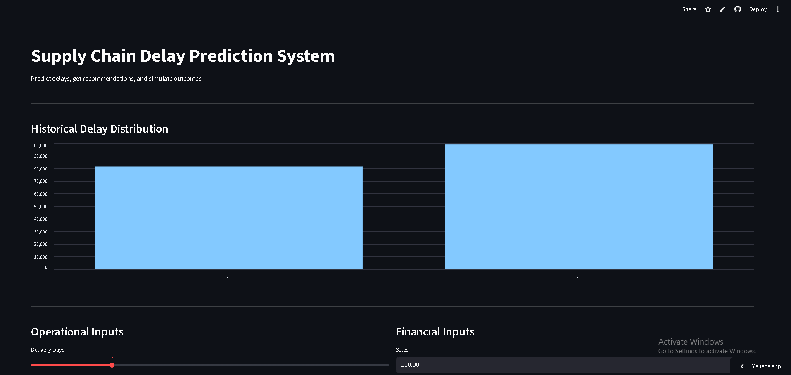
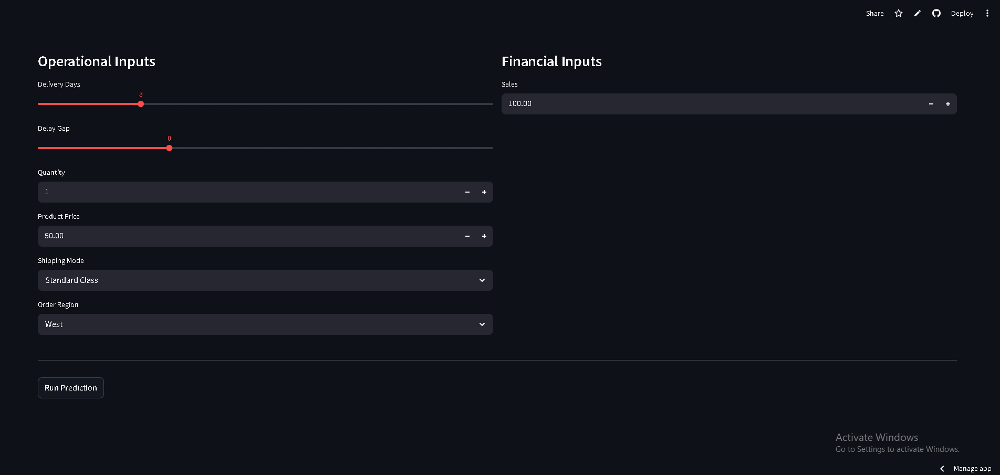
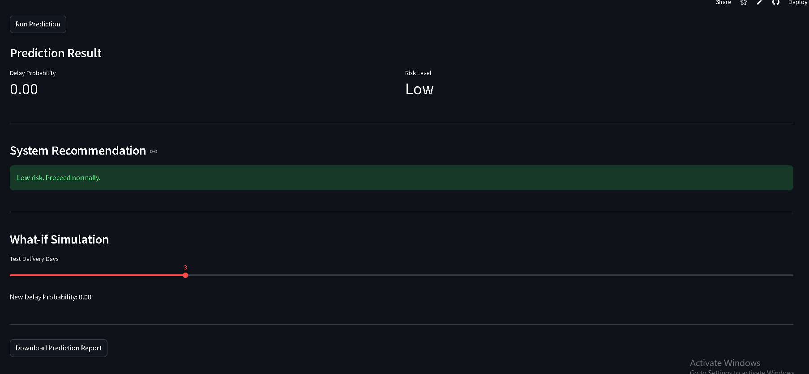

# Supply Chain Delay Prediction System

## Overview

This project predicts shipment delay risk and provides actionable recommendations to improve delivery performance.

## Problem

Delays in supply chain operations affect efficiency and customer satisfaction. The goal is to identify high-risk shipments early and support better decisions.

## Solution

* Built a machine learning model to predict delay risk
* Engineered features such as delivery duration and scheduling gaps
* Deployed the model as a Streamlit application
* Added automated recommendations based on risk level
* Implemented a what-if simulator for scenario testing

## Key Features

* Delay prediction (Low, Medium, High risk)
* Automated decision support
* Scenario simulation
* Downloadable report

## Screenshot

## Live App

https://supply-chain-delay-app-nzckm7ysyhpybwd7uqwojj.streamlit.app/

## Tech Stack

* Python
* Pandas, Scikit-learn
* Streamlit

## Project Structure

* `app.py` → Streamlit application
* `notebook/` → data analysis and modeling
* `requirements.txt` → dependencies

## Key Insight

Delivery delays are driven more by operational factors such as delivery duration and scheduling gaps than external conditions in this dataset.

## Future Improvements

* Separate training and inference for production deployment
* Integrate real-time data
* Deploy as an API
